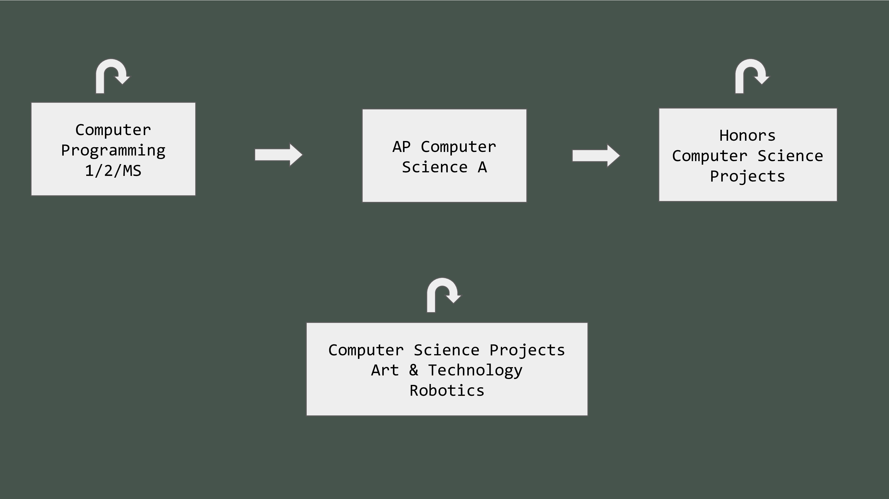
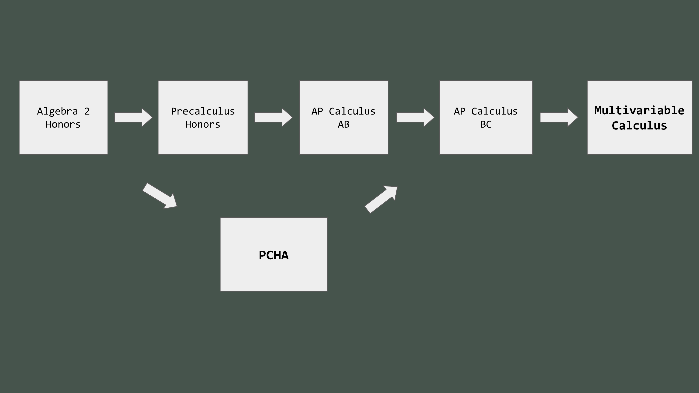

.center[
### Dr. Darren Kessner
Math and Computer Science Instructor   
Program Head of Computer Science and Software Innovation
]

 

6:00 __Advisory__   
6:15 __B__   
6:28 __C__ Pre-Calculus Honors Accelerated (PCHA)      
6:41 __D__ AP Computer Science (APCS)    
7:20 __E__   
7:33 __F__ Pre-Calculus Honors Accelerated (PCHA)  
8:11 __G__ Honors Computer Science Projects  
8:24 __H__   
8:37 __I__

[stem.marlborough.org](http://stem.marlborough.org)  

[dkessner.github.io/PCHA](http://dkessner.github.io/PCHA)  
[dkessner.github.io/APCS](http://dkessner.github.io/APCS)  
[dkessner.github.io/CSProjects](http://dkessner.github.io/CSProjects)  

---

### My role

- 9th year at Marlborough School
- Math and Computer Science Instructor
- Program Head of Computer Science and Software Innovation
- Advisor:
    * Code Violet (coding club)
    * Juggling Club

 
 
 

__Education / experience__: 

* Mathematics (BS, MA), Bioinformatics (PhD)
* Worked in software development for over 20 years
    - Anti-virus security
    - Computer graphics / user interface
    - Scientific applications (biology)

---

---

